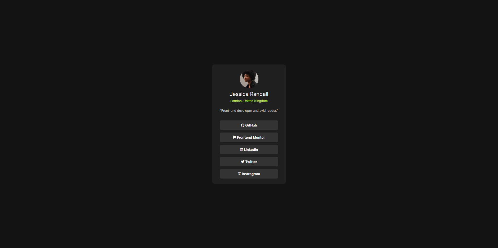
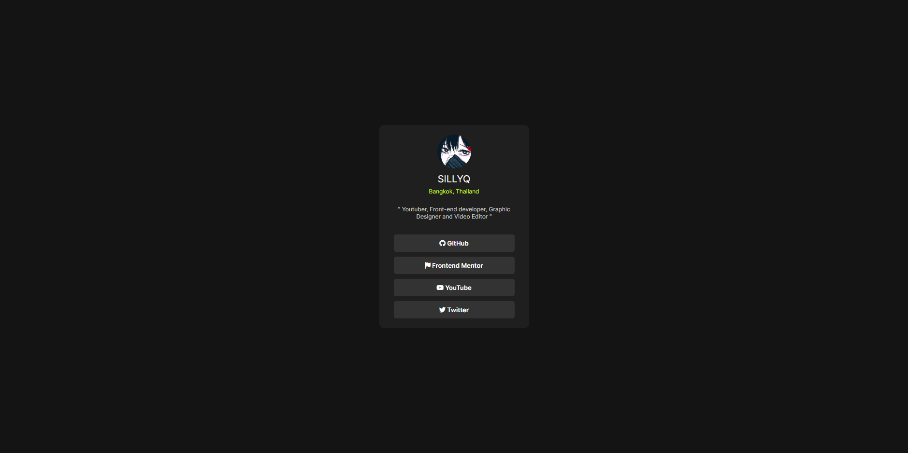

# Frontend Mentor - Blog preview card solution

This is a solution to the [Blog preview card challenge on Frontend Mentor](https://www.frontendmentor.io/challenges/blog-preview-card-ckPaj01IcS). Frontend Mentor challenges help you improve your coding skills by building realistic projects. 

## Table of contents

- [Frontend Mentor - Blog preview card solution](#frontend-mentor---blog-preview-card-solution)
  - [Table of contents](#table-of-contents)
  - [Overview](#overview)
    - [The challenge](#the-challenge)
    - [Screenshot](#screenshot)
    - [Links](#links)
  - [My process](#my-process)
    - [Built with](#built-with)
    - [What I learned](#what-i-learned)
    - [Useful resources](#useful-resources)
  - [Author](#author)

## Overview

### The challenge

Users should be able to:

- See hover and focus states for all interactive elements on the page

### Screenshot

- First version with default text
    

- Finished version with my own information
    

### Links

- [Live Site Version](https://sillyq.github.io/fed-sociallink)

## My process

### Built with

- Semantic HTML5 markup
- CSS custom properties
- Flexbox
- Awnsome Font
- CDNJS

### What I learned

- What & How to use `max-width` and `text-wrap`

### Useful resources

- [FontAwnsome](https://fontawesome.com) - Get special icons such as Brands and Characters without lightweight and efforts
- [CDN.JS](https://cdnjs.com/libraries/font-awesome) - For applying stuff (like AwnsomeFont in this project) without additional steps with link tags 

## Author

- Website - [sillyq.github.io](https://sillyq.github.io)
- Frontend Mentor - [@sillyq](https://www.frontendmentor.io/profile/sillyq)
- Twitter - [@qwrrrt_](https://www.twitter.com/qwrrrt_)